# gdsdxy-practiceSign
gdsdxy顶岗实习自动签到
今日你签到未？

提前步骤：创建腾讯云账号

* [gdsdxy\-practiceSign](#gdsdxy-practicesign)
  * [使用方法](#使用方法)
    * [腾讯云函数](#腾讯云函数)
    * [Docker部署](#docker部署)

---

## 使用方法

### 腾讯云函数

[登录腾讯云函数](https://console.cloud.tencent.com/scf)

1. 新建云函数

   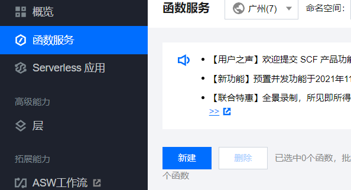

   选择【从头开始】
   运行环境选【Python3.6】

   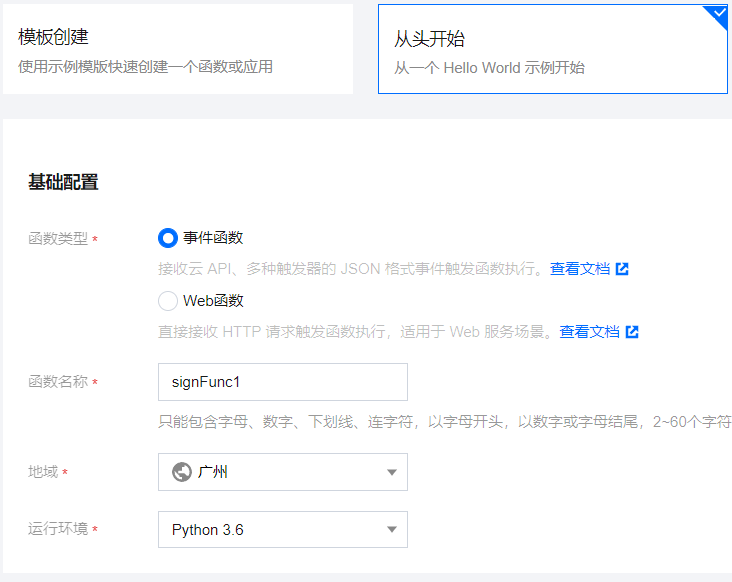

   本地上传zip包

   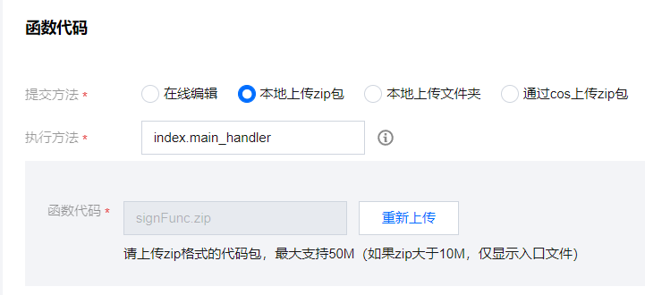

   高级配置-执行超时【900】

   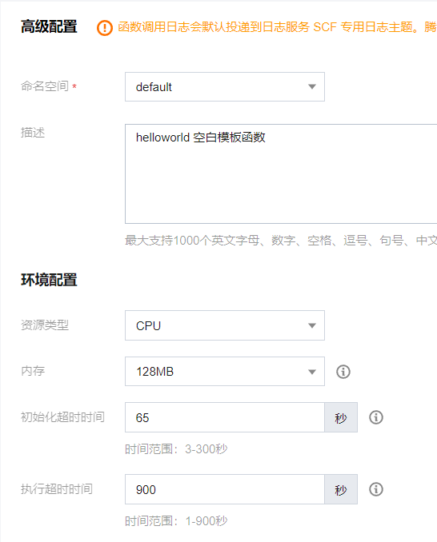

   触发器配置-自定义触发周期，填写【0 12,20 * * *】（每天12点和20点签到）

   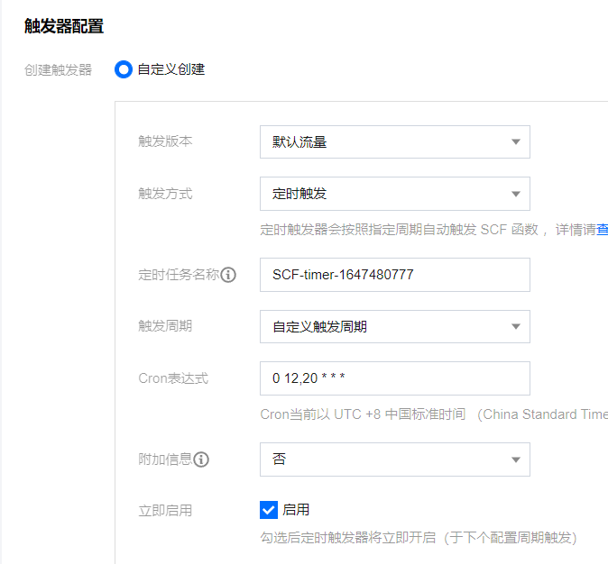

   完成

2. 配置

   立即跳转到函数页面-函数代码

   打开新终端

   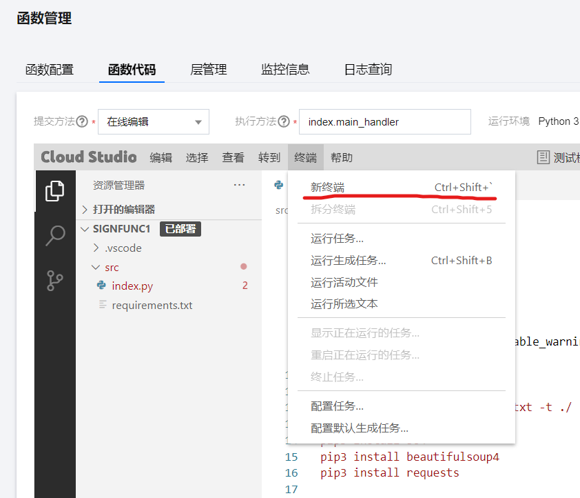

   输入命令

   ```shell
   cd src
   pip3 install -r requirements.txt -t ./ 
   ```

   完成后填写账号信息：账号，密码，[pushkey](https://github.com/easychen/pushdeer)（消息推送，可留空，建议填写以便获取信息）

   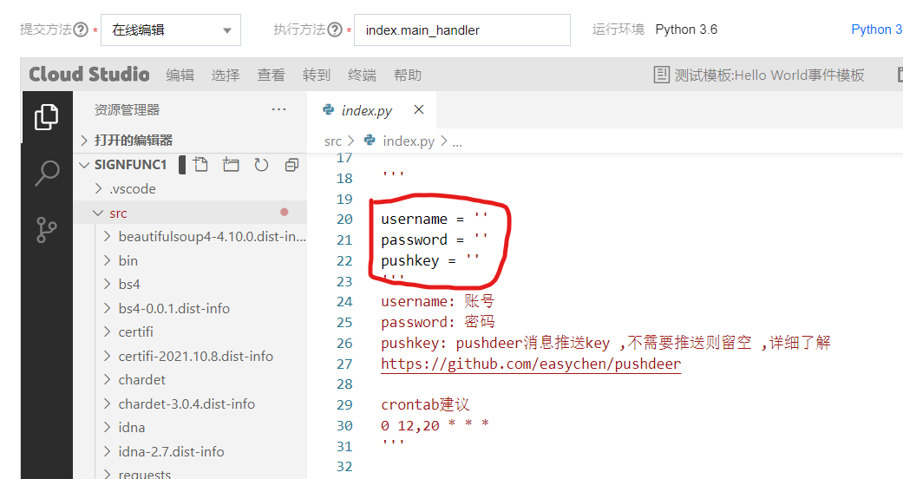

   点击【部署】

   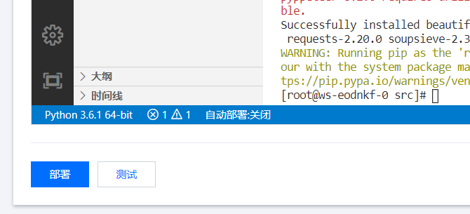

   等待部署成功就完成了配置。

3. 测试

   点击测试，等待片刻，即可去实习平台查看是否已经签到完成。

   消息推送：

   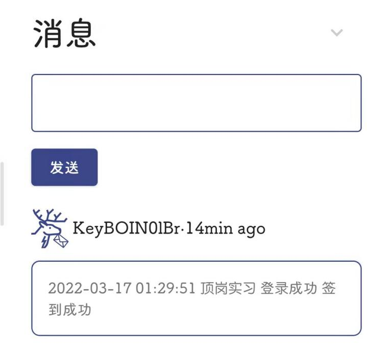

---

### Docker部署

0. 安装好Docker

1. 下载

   ```shell
   git clone https://github.com/jeblove/gdsdxy-practiceSign.git
   cd gdsdxy-practiceSign
   ```

   

2. 构建镜像

   ```shell
   docker build -t practicesign1 .
   ```

   等待出现
   Successfully tagged practicesign1:latest
   即完成构建镜像

3. 创建并启动容器

   ```shell
   docker run -d --name practiceSign1 \
   	-e username=<学号> \
   	-e password=<密码> \
   	-e pushkey=<推送密钥> \
   	practicesign1:latest
   ```
   
   运行不久后就能看到有推送消息
   
   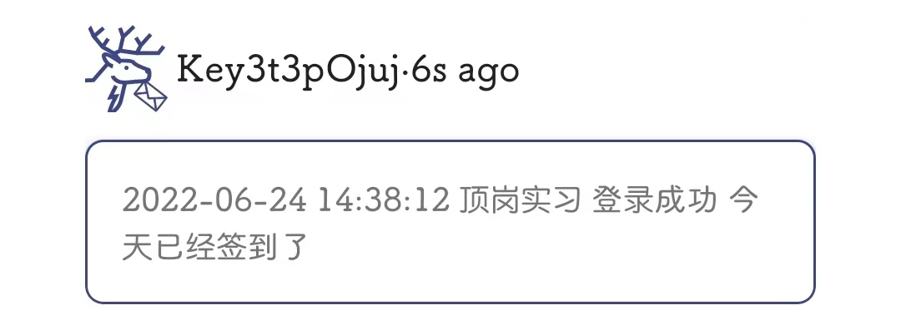
   
4. 设置定时启动

   ```shell
   crontab -e
   添加
   0 12,20 * * * docker start practiceSign1
   ```

   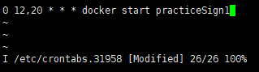

   完成

   ---

   
